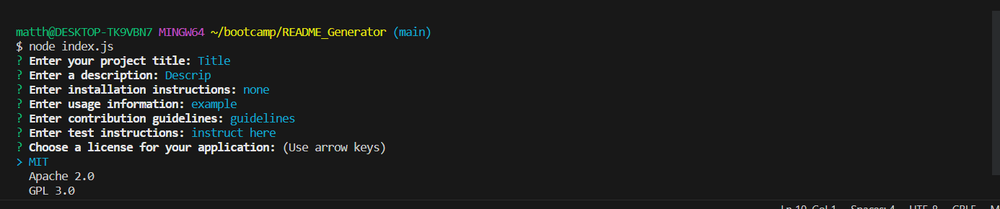

# README_Generator

## Website Link

N/A

## Screenshot

## Description

For this challenge we were tasked with building a README file generator app through the terminal.  We were given starter code and asked to use a couple of packages, "fs and inquirer," to prompt users with questions on the information they would like to include in their README.  Then using markdown, to generate the file using the data the user specified. This task was our first test on building apps through the terminal and not via the browser.  Not only was it practice of js we had used previosuly but a whole new process eniterly.  It tested our ability to pull in packages and use them, using const over var, use fs to write the file, inquirer to prompt the user, and markdown to actually make a new readme with the info.  Ultimately, this task was to help familirize us with the process of terminal coding by filling out starter code to make a usable app.  The other challenges were practcing using other skills we have used previously such as: if statements, else statments, =>, functions, calls for those functions, etc.  After pulling in the packages I would need: inquirer, fs, and generatemarkdown, the starter codes gave us a few functions to fill out to accomplish our task. A breakdown of how these functions operate and what I did for each are: "writeToFile" as a whole this functions serbes as a means to write the README based on the data inputted by the user.  I used fs to accomplish this while using a if else statment to say if there is no error, console log or ouput the notification that the ReadME was generated successfuly to the user.  Next was filling out the "init" function which called for the inquirer standard "prompt(questions)" "then(answers)" to give the users the question and take those answers and pass them through the generate markdown.  Then I called back to the "writeToFile" function to actually run that function with the markdown within.  Going over to the generateMarkdown.js file, for the license functions the code was given to us in class.  Lastly though I had to fill out the "generateMarkdown" function which gave the layout of the README with the data for each answer to each respective question for that titles data.

## Installation

N/A

## Usage

The application is a functional one that would help anyone in creating a README for their projects.  For myself I could theoretically use this to fill out my README's for projects going in the future.  Although, in truth it is not completely practical for this function though.  Even though this is the case, it still gave me great practice with coding for terminal based applications.

## Credits

(JD Tadlock)  (RUT-VIRT-FSF-FT-05-2023-U-LOLC)

## License

MIT License

Copyright (c) 2023 matthewlazarowitz

Permission is hereby granted, free of charge, to any person obtaining a copy
of this software and associated documentation files (the "Software"), to deal
in the Software without restriction, including without limitation the rights
to use, copy, modify, merge, publish, distribute, sublicense, and/or sell
copies of the Software, and to permit persons to whom the Software is
furnished to do so, subject to the following conditions:

The above copyright notice and this permission notice shall be included in all
copies or substantial portions of the Software.

THE SOFTWARE IS PROVIDED "AS IS", WITHOUT WARRANTY OF ANY KIND, EXPRESS OR
IMPLIED, INCLUDING BUT NOT LIMITED TO THE WARRANTIES OF MERCHANTABILITY,
FITNESS FOR A PARTICULAR PURPOSE AND NONINFRINGEMENT. IN NO EVENT SHALL THE
AUTHORS OR COPYRIGHT HOLDERS BE LIABLE FOR ANY CLAIM, DAMAGES OR OTHER
LIABILITY, WHETHER IN AN ACTION OF CONTRACT, TORT OR OTHERWISE, ARISING FROM,
OUT OF OR IN CONNECTION WITH THE SOFTWARE OR THE USE OR OTHER DEALINGS IN THE
SOFTWARE.

